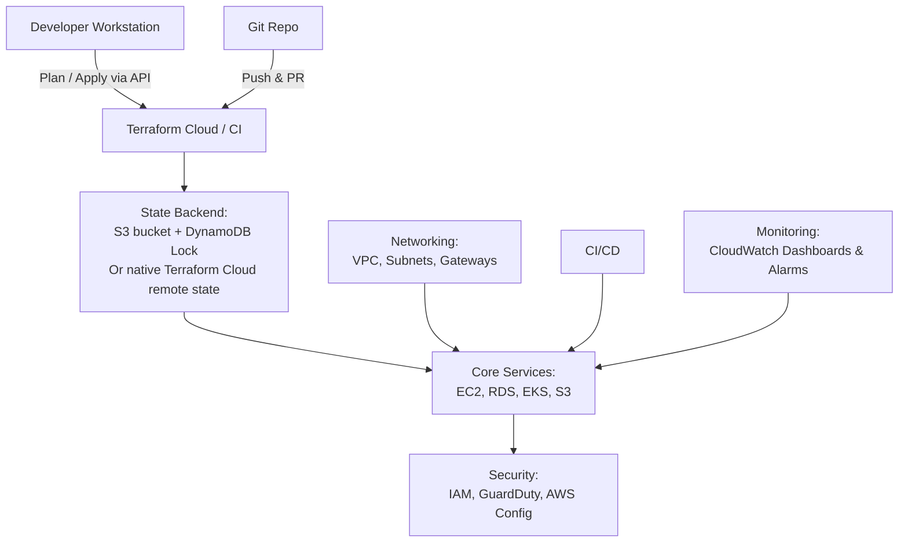

# Terraform Multi-Environment Cloud Infrastructure

[](https://www.terraform.io)  
[](LICENSE)

A fully automated, multi-environment Terraform codebase for provisioning cloud infrastructure with remote state, CI/CD, monitoring, and embedded security controls.

---

## 🚀 High-Level Architecture



---

## 📁 Project Structure

- **modules/**: Reusable Terraform modules (network, compute, EKS, storage, database, security, monitoring).  
- **envs/**: Environment-specific configs (`dev`, `staging`, `prod`), each with its own `backend.tf`, `provider.tf`, `main.tf` and `terraform.tfvars`.  
- **scripts/**: Utility scripts for formatting, validation, planning & applying.  
- **.github/workflows/**: GitHub Actions pipeline for PR validation and gated `apply` on `main`.  
- **README.md**: This file.

---

## ⚙️ Prerequisites

- Terraform 1.5+ installed locally  
- AWS CLI configured with appropriate credentials  
- (Optional) Terraform Cloud account or S3 + DynamoDB for remote state  
- GitHub repo and secrets for AWS creds / Terraform Cloud token  

---

## 🔧 Getting Started

1. **Clone the repo**  
   ```bash
   git clone git@github.com:<your-org>/<your-repo>.git
   cd <your-repo>
   ```

2. **Initialize Terraform**  
   ```bash
   cd envs/dev
   terraform init
   ```

3. **Plan & Apply**  
   ```bash
   ./../../scripts/plan_apply.sh dev
   ```

4. **Promote to staging / prod**  
   - Push changes to `staging` branch → auto-deploys to staging  
   - Merge `staging` → `main` → auto-deploys to prod  

---

## 🌐 Remote State & Locking

Each environment’s `backend.tf`:

```hcl
terraform {
  backend "s3" {
    bucket         = "acme-terraform-state"
    key            = "envs/${terraform.workspace}/terraform.tfstate"
    region         = "eu-west-1"
    dynamodb_table = "acme-terraform-locks"
    encrypt        = true
  }
}
```

---

## 🔄 CI/CD Pipeline

`.github/workflows/terraform.yml`:

```yaml
name: Terraform

on:
  pull_request:
    branches: [ dev, staging, main ]
  push:
    branches: [ main ]

jobs:
  terraform:
    runs-on: ubuntu-latest
    steps:
      - uses: actions/checkout@v3
      - name: Setup Terraform
        uses: hashicorp/setup-terraform@v2
      - name: Select Workspace
        run: |
          terraform workspace select "${{ github.ref_name }}"             || terraform workspace new "${{ github.ref_name }}"
      - name: Init
        run: terraform init -input=false
      - name: Fmt & Validate
        run: |
          terraform fmt -check
          terraform validate
      - name: Plan
        run: terraform plan -out=tfplan -input=false
      - name: Apply
        if: github.ref == 'refs/heads/main'
        run: terraform apply -auto-approve tfplan
```

---

## 🔐 Security & Best Practices

- **Module version pinning** via Git tags.  
- **Lint & Security Scans**: Integrate `tflint`, `tfsec` in CI.  
- **Secrets Management**: AWS Secrets Manager provider for DB creds.  
- **Least Privilege** IAM roles per environment.  
- **Tagging Strategy**: `env`, `project`, `owner` tags on all resources.

---

## 🤝 Contributing

1. Fork & create a feature branch.  
2. Make changes & update documentation.  
3. Open a PR against `dev`.  
4. Ensure GitHub Actions passes all checks.  
5. Merge to `staging` → QA → Merge to `main` for production.

---

## 📄 License

This project is licensed under the MIT License.
