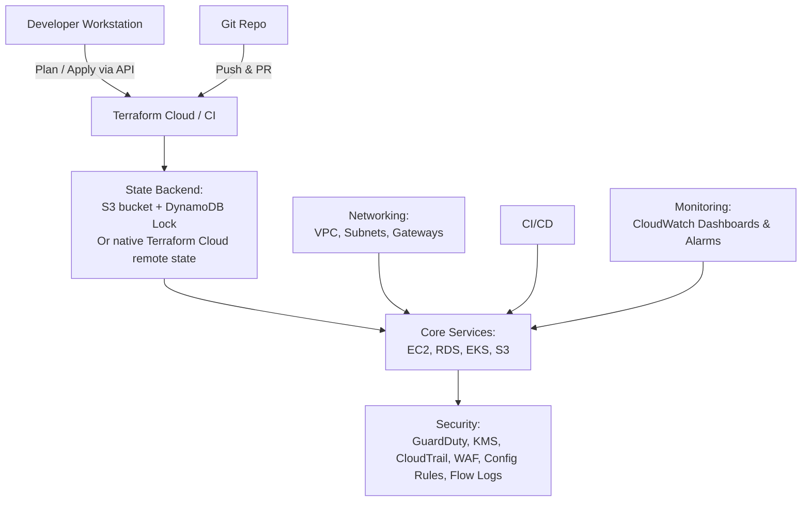

# Terraform Multi‐Environment Cloud Infrastructure

A fully automated, multi‐environment Terraform codebase for provisioning cloud infrastructure with remote state, CI/CD, monitoring, and embedded security controls.

---

## 🚀 High-Level Architecture

---

## 📁 Project Structure

- **modules/**: Reusable Terraform modules (network, compute, EKS, storage, database, security, monitoring).  
- **envs/**: Environment-specific configs (`dev`, `staging`, `prod`), each with its own `backend.tf`, `provider.tf`, `main.tf` and `terraform.tfvars`.  
- **scripts/**: Utility scripts for formatting, validation, planning & applying.  
- **.github/workflows/**: GitHub Actions pipeline for PR validation and gated `apply` on `main`.  
- **README.md**: This file.

---

## 🔐 Embedded Security Controls

1. **GuardDuty** enabled in all regions  
2. **AWS KMS** CMK for encryption of data at rest  
3. **AWS CloudTrail** multi-region audit logging with log file validation  
4. **AWS Config Rule** enforcing S3 bucket encryption  
5. **AWS WAFv2** Web ACL for application protection  
6. **VPC Flow Logs** for network traffic auditing  
7. **Least-Privilege IAM Policies** for all roles  
8. **S3/DynamoDB** remote state encrypted and locked  
9. **CI/CD Pipeline** role segregation and manual prod approval  

---

(Other sections omitted for brevity)
